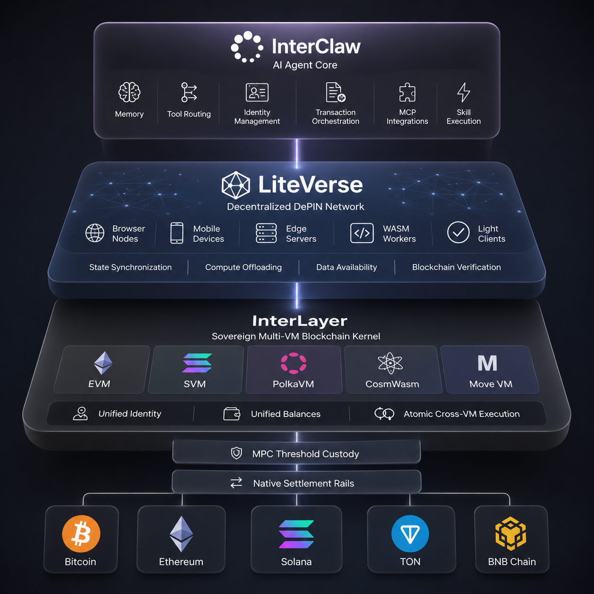

# 8 Months of Solo Hacking: Building a 5-VM Substrate Kernel, a DePIN Client Mesh, and the AI Agent Stack for a Web3 Smartphone

Hi Polkadot Community! 👋

My name is Bharath, I'm from Coorg in southern India. This is my first post here.

I want to be upfront before anything else: I originally bought EDG as an investor, believed in what Edgeware was trying to do, and then started contributing to the chain directly. I ended up being the last person to receive a grant from the Edgeware treasury before it shut down. By then I was sitting on 100 million+ EDG — a mix of what I'd bought as an investor and what I'd received from the treasury for my work — and all of it is worth essentially zero today. So the whole time I was building, I was watching my savings evaporate while trying to save the thing I'd put them into. I couldn't turn it around. Edgeware is gone.

I do want to say — through all of that, Shankar Warang and Remz believed in me when it wasn't obvious anyone should. The broader ex-Edgeware community was genuinely supportive, and I'm grateful for that. That belief is a big part of why I kept going.

What I came away with is something that money can't buy: real, hands-on experience building Substrate infrastructure from scratch, alone, under pressure, with no team.

Rather than walk away from that, I kept building. For the last eight months I've been self-funding everything while working a last-mile delivery job on the side to pay rent. Most of my dev work happened on a VNC viewer connected to a cheap Ubuntu VPS. When those AWS credits ran out, I moved to Contabo — it's slower and less reliable, but it's what I can afford right now.

I'm not sharing this for sympathy. I'm sharing it because I want you to understand who is behind this, and why this post exists. I'm not a VC-backed team with a polished pitch deck. I'm one person who built something real and is now asking the Polkadot community directly: does this belong in the ecosystem, and can you help me take it further?

---

*Sorry for the long post! Since this is a massive write-up covering eight months of solo hacking, if you'd prefer a quick summary or want to feed this directly to an AI assistant (like ChatGPT, Claude, or Gemini) to present or summarize it for you, feel free to use the raw markdown file here: [polkadot-forum-post-bharathcoorg.md](https://github.com/Bharathcoorg/links/raw/refs/heads/main/polkadot-forum-post-bharathcoorg.md)*


## What I Built: The Foundation for a Decentralized Future

Let's be honest about the state of crypto today: **it is incredibly fragmented and broken for the average person.** 
*   **Liquidity is scattered** across a dozen different isolated L1s and L2s. 
*   **Developers are split** by language barriers (some only write Solidity, others Rust, others Move).
*   **There is no single "superchain"** that lets you control and settle everything in one place.
*   **None of it is AI-friendly.**

The next generation of crypto users won't be humans manually clicking buttons, deciphering hex codes, and signing transactions on Metamask. **They will be AI agents.** They will manage portfolios, execute complex trades, and run automation on our behalf. But right now, the industry simply does not have the infrastructure to support them. 

My ultimate goal—the dream I've been working toward through all of this—is to build the software stack for a **true blockchain smartphone**. A secure, physical device in your pocket that runs a local node, secures your identity, and has a personal, trusted AI agent that safely handles your decentralized life.

To make that dream a reality, you need three distinct pieces of infrastructure working together as one. That is what I built. **Everything is fully coded, integrated, and active on devnet right now.** This isn't a theoretical pitch; it is a live ecosystem structured around three pillars:

*   **InterLayer (The Multi-VM Blockchain Kernel)**: The engine that solves language and liquidity fragmentation by letting you run EVM, SVM, PolkaVM, CosmWasm, and Move contracts natively on the same chain, side-by-side, with a shared balance, a unified interface, and built-in support for external chains.
*   **LiteVerse (The DePIN Infrastructure)**: The client-side compute network that runs in browsers and on mobile phones, turning normal devices into nodes that sync state and watch deposits. This is the starting architecture for the mobile blockchain OS.
*   **InterClaw (The On-Chain Agent Layer)**: A decentralized, OpenClaw-like assistant that provides secure, serverless automation, executing transactions and orchestration tasks directly across the InterLayer multi-VM kernel and the LiteVerse DePIN storage network.

This stack is ready. It isn't a slide deck—it is a functional reality deployed on devnet today. And this is just the beginning. 

Here is how these three pieces connect visually, followed by a deep dive into the technical details of each layer.




---

## 1. InterLayer Blockchain (The sovereign Multi-VM Blockchain Kernel)

InterLayer (originally conceived as Edgeware 2.0 before I decided a fresh sovereign chain was the right path rather than a revival) is a sovereign Substrate L1 chain designed around one core idea: **a single state machine that natively runs smart contracts from five different virtual machines at the same time, acting as a superchain settlement engine**.  Currently, the InterLayer Gravity Devnet is fully active, demonstrating live cross-VM interoperability and consensus.


### Multi-VM Execution Layer (MEL)

Rather than maintaining separate, isolated networks, all five virtual machines run natively inside the same Substrate runtime, sharing a single global state and account balance system under the **Multi-VM Execution Layer (MEL)**. 

To make onboarding seamless, the chain exposes **individual, fully compatible RPC interfaces for each VM**. Developers don't need to learn new tools or adapt to custom frameworks; EVM developers can use standard EVM RPC endpoints with Foundry or Hardhat, and Solana developers can connect Anchor directly to the SVM RPC:

| VM | Compatible with | Tooling & Developer UX |
|----|-----------------|------------------------|
| **EVM** | Ethereum Solidity | Standard EVM RPC compatibility (Foundry, Hardhat, MetaMask) |
| **SVM** | Solana programs | Native SVM JSON-RPC support (Anchor, Solana CLI, Phantom) |
| **PolkaVM** | RISC-V (Polkadot ink!) | Standard Substrate RPC (Polkadot{.js}, cargo-contract) |
| **Move VM** | Aptos / Sui | Move CLI and resource-safe module deployment tooling |
| **CosmWasm** | Cosmos CosmWasm | CosmJS and WASM contract deployment schemas |

Every VM is integrated as a native Rust adapter inside the Substrate runtime. The EVM uses `revm` (v33.1), the SVM uses a patched `solana_rbpf`, Move runs with full module and resource storage, PolkaVM runs RISC-V contract bytecode, and CosmWasm completes the five.

#### How It Works: The MEL Transaction Format

To execute transactions across completely different virtual machines, all payloads are packed into a unified **MEL Transaction Envelope** (`MultiVmTransaction`). Instead of forcing users to manage multiple wallets or sign multiple times, the envelope acts as a single container signed once by your primary wallet key.

The envelope's basic layout consists of:
*   **`from` / `to`**: Address bytes representing the sender and recipient.
*   **`vm`**: The target execution environment (e.g., `EVM`, `SVM`, `Move`, `CosmWasm`, or `PolkaVM`).
*   **`payload`**: The raw transaction bytes (like a signed EVM RLP transaction or a serialized Solana transaction).
*   **`auth_scheme`**: The signature verification method (such as `Ecdsa`, `Ed25519`, `Sr25519`, or `Native` for adapters that verify their own signatures).
*   **`signature`**: The outer signature verifying the transaction on the Substrate consensus boundary.

Here is a concrete example of how developers build and submit a MEL transaction using JavaScript to wrap a signed EVM payload:

```javascript
// 1. Package the signed EVM RLP transaction into the MEL envelope
const melTx = {
  from: Array.from(ethers.getBytes(evmAddress)),
  to: Array.from(ethers.getBytes(contractAddress)),
  vm: { EVM: null },                 // Target VM
  payload: Array.from(evmRlpBytes),  // Signed EVM transaction bytes
  gas_budget: 21000,
  nonce: Date.now(),
  chain_id: 1337,
  auth_scheme: { Native: null }      // Let EVM adapter verify internal sig
};

// 2. Submit the envelope natively to the chain
const txHash = await api.tx.melCore
  .executeMelTransaction(melTx)
  .signAndSend(senderKeypair);
```

### RPC Endpoints

To make integrating with existing tools as easy as changing a configuration URL, our testnet exposes **dedicated, direct sub-domains** that mimic native VM environments natively:

*   **Global Entrypoints**:
    *   **HTTP RPC**: `https://rpc.interlayer.one`
    *   **WebSocket (WSS)**: `wss://ws.interlayer.one`
    *   **Node Compatibility Alias**: `https://node.interlayer.one` / `wss://node.interlayer.one`
    *   **Polkadot{.js} Apps Console**: [Interactive Explorer Console](https://polkadot.js.org/apps/?rpc=wss%3A%2F%2Fnode.interlayer.one#/explorer)
*   **Direct VM RPC Endpoints**:
    *   **EVM (Ethereum compatibility)**: `https://evm.interlayer.one` (MetaMask, Foundry, Hardhat)
    *   **SVM (Solana compatibility)**: `https://svm.interlayer.one` (Phantom, Anchor, Solana CLI)
    *   **PolkaVM (RISC-V)**: `https://polkavm.interlayer.one` (Polkadot{.js}, cargo-contract)
    *   **Move VM**: `https://move.interlayer.one` (Move CLI toolchain)
    *   **CosmWasm**: `https://cosmwasm.interlayer.one` (CosmJS tools)
*   **Testnet Network Details**:
    *   **Network Name**: Gravity Testnet
    *   **Chain ID**: `2021` (EVM compatible)
    *   **Currency Symbol**: `IL`


### Atomic Execution — The Hard Part

This is the part I'm most proud of technically. When a user submits a cross-VM bundle — say, an EVM contract call and an SVM program call in the same transaction — the runtime takes state snapshots of both VMs before executing anything. If either side fails, everything rolls back atomically. No partial commits. No bridge delays. No trust assumptions between VMs.

The execution phases are: Validation → Snapshot → SourceExecution → TargetExecution → Confirmation → Commit or Rollback.

The `unified-balance` pallet sits underneath this and locks the user's native balance before MEL acquires a VM lock, then releases it on commit or rollback. This prevents double-spends across VMs at the consensus level.

### HotStuff Consensus & Validator Nodes

I replaced the default Aura/GRANDPA setup with a custom HotStuff-family BFT consensus engine. The target is 100ms slots with sub-3-second finality. When I was running validator tests on high-performance AWS instances, the engine achieved a lightning-fast 100ms to 200ms block time. Now that my credits ran out and I'm hosting on cheaper, slower Contabo VPS nodes, block production is slower—but the underlying BFT consensus logic is fully implemented and solid.

The **Validator Nodes** handle block production, transaction ordering, and contract execution directly (without needing separate, complex sequencers or off-chain builders), ensuring a fast and highly secure network. To keep validators honest and active, their performance is scored on-chain using an automated mathematical formula based on three real metrics: **50% weight is placed on node uptime**, **30% on block production rate**, and **20% on voting participation**. This performance score feeds directly into how rewards are calculated and paid out.

### CEX-Style Personal Deposit Addresses

Instead of using standard, risky wrapped tokens or lock-and-mint bridge smart contracts, every user gets a **unique, personal deposit address on Bitcoin, Ethereum, Solana and other external chains**. 

This functions exactly like a CEX (Centralized Exchange) deposit address (like on Binance or Coinbase), but is **fully decentralized, verified on-chain, and secured by the network**. The system is backed by a 5-node MPC (Multi-Party Computation) cluster where any 3 nodes must cooperatively sign, ensuring no single operator can ever move your funds. 

While we are starting with these core assets, the underlying architecture is modular and has **no limits**—it is designed to easily scale to support any EVM, SVM, UTXO, or any other external chain in the future. 

**Current Live Status on Devnet**:
*   **Solana Devnet & Ethereum Sepolia**: End-to-end deposits and withdrawals are **fully functional**.
*   **Bitcoin**: Deposits are **fully functional**, with withdrawals currently restricted to manual execution due to public Bitcoin testnet RPC issues.

**How it Works Under the Hood**:
To keep the bridging process completely automated, InterLayer uses Substrate **Off-Chain Workers (OCWs)** running directly within validator nodes to query external chains and initiate MPC address generation. 
*   **LiteVerse Watcher Network**: The actual deposit monitoring is backed by **LiteVerse DePIN nodes** acting as *Shadow Bridge Watchers*. These light client nodes monitor deposit addresses, sync headers, and submit verified deposit witnesses on-chain.
*   **Watcher Rewards**: To incentivize this DePIN network, LiteVerse nodes are rewarded with **20% of the bridge routing fee** for every deposit witness they successfully submit.

For the current devnet testing, I am running my own MPC nodes to validate the DKG and threshold signing. However, for a production mainnet launch, we can massively reduce operational risk by partnering with professional, 3rd-party institutional custody providers. This allows us to keep full on-chain control of the wallet logic while backing the assets with institutional insurance.

To coordinate this secure, decentralized custody, InterLayer uses advanced threshold signing math, allowing the MPC nodes to safely generate keys and sign transactions without any single node ever seeing or possessing the full key. The system is designed around standard key formats, meaning a single, unified backup phrase can automatically derive all of your active deposit addresses across different networks. 

To guarantee speed without compromising security, we use a tiered storage model: **5% of the assets** are kept in a highly liquid hot wallet pool to support instant, automated withdrawals, while the remaining **95% is safely locked** in a modular sub-treasury. Furthermore, instead of processing withdrawals one-by-one, the system automatically bundles up to 50 user withdrawals into a single batched transaction—cutting gas fee overhead by **90% to 99%** for everyone.

### Human-Readable Handles (ENS meets EOS Native Names)

In most blockchains, your identity is an unreadable 40-character string of hex characters, requiring you to pay for external domain directories like ENS to make it human-readable. In other chains like EOS, accounts are natively human-readable handles. 

InterLayer unifies both of these approaches directly at the core blockchain level. Every user has a **native, built-in, human-readable handle** that acts as their canonical on-chain identity:

*   **Zero-friction Auto-Registration**: To make onboarding completely seamless, your very first transaction automatically registers a **free, fun, and random username** (like `stellar_phoenix_4829`) directly to your account with zero storage deposits or registration fees required.
*   **Your Name, Your Choice**: If you prefer a custom username, registering a custom handle (using simple characters like `a-z`, `0-9`, and underscores) is **completely free for your first registration**, letting you claim your digital footprint instantly without any initial setup costs.
*   **Flexible Updates & Community Treasury**: If you ever decide to change your registered username later, you can do so for a small, simple fee of **exactly 1 IL token**. To align incentives, this fee doesn't go to developers or private companies—it is sent directly to the community-governed Treasury.
*   **Seamless Cross-Chain Address Resolution**: Instead of copy-pasting complex addresses, you can easily bind your external EVM, SVM, Move, CosmWasm, or PolkaVM wallet addresses directly to your handle. Under the hood, the system uses a smart dual-lookup registry to resolve these names automatically. Rebinding your addresses to a new virtual machine or wallet is easy and charges a tiny fee of **0.5 IL tokens** (also routed directly to the community treasury), ensuring AI agents, wallets, and bridges can route your funds flawlessly without any risk of copy-paste errors.

### Robust Multi-VM MEV & Bot Protection

Running multiple virtual machines simultaneously opens the door to sophisticated transaction exploitation, front-running, and bot manipulation. To ensure a completely fair playing field for everyday users, InterLayer features a core-level **Multi-VM MEV Control and Bot Defense Engine**.

Instead of letting predatory bots exploit transaction ordering, our engine actively monitors, manages, and mitigates multi-VM attack vectors directly at the block level:

*   **Atomic Multi-VM Bundles**: Users can group multiple operations across different virtual machines into a single, cohesive **Atomic Bundle**. If any single part of the bundle fails, the entire transaction set gracefully cancels—eliminating the risk of partial execution or sandwich exploitation.
*   **Intelligent Sandwich & Attack Detection**: The system continuously analyzes transaction patterns to detect bots attempting sandwich attacks. If a malicious bot is caught exploiting standard user transactions, the engine instantly flags the account and routes them directly to a **system-wide blacklist**.
*   **Fair Ordering Timing Delays**: By enforcing built-in delays and timing analyses at the mempool level, the blockchain ensures transaction sequence fairness, preventing front-running bots from jumping the line by outbidding users on transaction priority.
*   **Block-Level Gas & Call Safeguards**: The engine maintains block-wide limits on cross-VM execution density and gas consumption. This keeps the network highly responsive and prevents spam attacks from degrading blockchain performance.
*   **10% MEV Tax & Community Real-Yield**: If structured MEV arbitrage does occur, the engine levies a **10% tax on the arbitrage profits**. This captured tax isn't pocketed by validators—it is fed directly back into community rewards, supporting delegators, stakers, and ecosystem growth.

### Staking & Where the Fees Go (No Inflation, Real Yield)

Most blockchains print new tokens constantly to pay for security, which slowly devalues the tokens you hold. InterLayer does not. There is **0% token inflation**. Staking yields come entirely from real transaction fees generated by people actually using the network.

When a transaction is made, the fees are automatically split and distributed natively by the core execution logic:

*   **80% goes to the Security Pool (Validators and Delegators)**: This rewards the people securing the network. Instead of distributing rewards blindly, the system splits this pool among active validators based on their actual performance (block proposals, voting participation, and uptime). Delegators who lock (bond) their tokens to validators earn their pro-rata share with simple lazy claiming.
*   **10% goes to the LiteVerse DePIN Pool**: This goes directly to the distributed light-client participants (the browser, mobile, and server nodes) who sync headers and perform Data Availability Sampling, keeping the ecosystem fast, decentralized, and accessible.
*   **10% goes to the Ecosystem Treasury**: This pool is governed directly by token holders and is used to fund community grants, upgrades, and open-source growth.

### Quantum-Resistant Signing

For governance and treasury operations, the chain supports post-quantum signatures using Dilithium and Falcon (`pqcrypto-dilithium`, `pqcrypto-falcon`). Ed25519/Sr25519 stays for normal developer UX, PQ is for high-value operations.

### Native Zero-Knowledge Proof Verification

To support private identities and high-speed off-chain apps, I integrated a native **ZK Verification Engine** directly into the blockchain runtime. Instead of making developers build gas-heavy verification logic inside their smart contracts, the network handles it instantly out of the box. It supports multiple proof systems like **Groth16** (using Arkworks) and **PLONK** across curves like BN254 and BLS12_381, offers fast batch verification to save space, and exposes a dedicated **EVM precompile**. This allows Ethereum contracts to run zero-knowledge transactions, bridges, and logins with almost zero gas overhead. Support for additional proof systems and curves will be added soon.

### A Sovereign Governance & Treasury Operating Console

True decentralization requires a system that is far more resilient than basic token-based snapshot voting. By building upon and significantly improving Polkadot’s native **OpenGov** framework, InterLayer introduces a custom-built, highly optimized **Governance and Treasury Operating System** tailored perfectly to coordinate our hybrid voting weight, multi-chain treasury, and milestone-based execution tracks.

Rather than relying on disjointed off-chain forum pages, this native governance suite coordinates several major pillars directly at the blockchain kernel level:

*   **Hybrid Voting (Tokens + Reputation)**: To prevent simple plutocracy where large token holders dominate every decision, InterLayer implements a hybrid voting weight model. Your active voting influence is calculated dynamically by combining your **bonded token weight** with your **historical ecosystem reputation** (earned through constructive participation, verified milestones, and validator uptime). To encourage broad, high-quality community participation, a dedicated portion of the Treasury is distributed annually as **governance rewards** to active, thoughtful voters.
*   **Three-Tier Treasury Safeguards**: Traditional blockchain treasuries are highly vulnerable to single-point exploits and coordinate poorly with contributors. InterLayer resolves this through three distinct native treasury pools:
    1.  *Main Native Treasury*: The primary capital pool governed directly by community-wide token voting for upgrades and core network funding.
    2.  *Multi-Chain Treasury*: Secure, native bridging smart accounts that hold and disburse external assets (like ETH, SOL, DOT, or BTC) directly to foreign chain addresses based on governance outcomes.
    3.  *Special-Purpose Treasuries*: Instead of transferring large lump sums to standard multi-sig wallets where contributors could vanish or misuse funds, InterLayer locks project budgets in dedicated, task-specific smart pools. If a team disappears, underperforms, or violates milestone agreements, governance can instantly sweep the remaining capital back to the main treasury, ensuring that capital is never held hostage.
*   **Milestone-Based Contracts**: To maximize accountability, all major funding allocations—including my own compensation as a founder—are structured as active, on-chain contracts tied to specific milestone deliverables. If a contractor underperforms, token holders can vote to pause or cancel active payment streams, ensuring every token spent translates directly to verified value.
*   **Staked Coin Output (SCO) Programs**: SCO is a flexible ecosystem funding model where projects allocate part of their token supply into a reward pool. Stakers deposit eligible assets (native IL tokens or bridged external assets like BTC or SOL) into these pools to earn new project tokens at a fixed APY. Stakers retain their underlying capital, which is safely returned after the lock period, creating a risk-mitigated environment for bootstrapping new applications.
*   **Fixed Block Space Subscriptions**: To provide absolute cost predictability for enterprise partners, governments, and non-profits, organizations can pay a predictable, flat subscription fee to lease guaranteed block space, shielding their operations from volatile transaction gas spikes.
*   **Dynamic Gas Sponsorship & Acceptance of Multi-Chain Gas Assets**: To encourage creative projects, decentralized applications can establish **Gas Stations** to let users pay transaction fees using the DApp's own native project token. Natively, InterLayer accepts and whitelists popular external assets for gas fees—including **BTC, DOT, ETH, BNB, and SOL**. Furthermore, to support upcoming projects in a completely permissionless manner, any custom token that maintains a minimum of **$10,000 in liquidity** on our integrated decentralized exchange (DEX) is **automatically accepted as a gas fee option** across the network.

Currently, the governance application is live as a functional, interactive proof-of-concept (about 60% complete), serving as the administrative console for our entire multi-chain economy. You can explore the interface live at [gov.interlayer.one](https://gov.interlayer.one) and log in easily using **"Alice Demo Mode"** to experience its full capability firsthand.

### The InterLayer Multi-VM Block Explorer & Intelligence Platform

One major lesson I took away from my time with Edgeware is just how vital a dedicated block explorer is to the life of a blockchain community—and how much it hurts when external service providers like Subscan choose to exit. Even when trying to patch the gap with separate setups like Blockscout, Statescan, and Polkastats, having a fragmented experience was never enough for developers or everyday users. 

To solve this permanently, I decided to eliminate external service dependency entirely by building a high-performance, custom in-house explorer from the ground up. This not only drastically cuts operational costs for the network, but also provides developers and the community with a unified, native home to watch the ecosystem grow. 

To make this work for our unique five-VM architecture, I had to synthesize the combined experiences of **Etherscan, Solscan, Subscan, Suiscan, and Cosmoscan** into a single, cohesive dashboard. Ultimately, a multi-VM blockchain is only as good as your ability to see and understand what is happening inside it. The **InterLayer Block Explorer** is built as a comprehensive blockchain intelligence platform designed to parse, decode, and visualize events across all five virtual machines simultaneously.

Instead of displaying raw, unreadable hexadecimal logs, this explorer serves as a complete window into our multi-chain economy:

*   **Native Support for All 5 VMs**: The indexer traces, decodes, and standardizes transactions across EVM, SVM, Move, CosmWasm, and PolkaVM natively. You can inspect unified token balances, follow atomic swap paths, and monitor gas usage using a single, unified search console.
*   **AI-Powered Transaction Explainer**: To make reading the blockchain approachable for everyone, the explorer integrates a secure AI engine that translates dense execution payloads into simple, plain English summaries. For instance, instead of decoding complex routing logs, it will instantly show: *"Alice swapped 1.5 ETH for USDC, routed it through the Multi-VM Execution Layer, and staked it in Solana's Marinade Finance for 5.2% yield."*
*   **No-Code Dune-Style Analytics**: Users and developers can build custom, live dashboards to track total value locked (TVL), transaction counts, whale activity, and contract trends without writing a single line of SQL. It features an intuitive, drag-and-drop Visual Query Builder that updates real-time charts on the fly.
*   **Pre-Execution Simulation**: Before signing a transaction, developers and users can run "What-If" simulation diagnostics. The explorer pre-runs the code in a virtual environment to predict exact output, gas costs, slippage margins, and security warnings (such as unlimited allowance risks or upgradeable proxy backdoors), completely eliminating execution surprises.
*   **Live Test & Execution Tracking**: The explorer comes pre-configured with dedicated views to monitor the live tests, transaction sequences, and era changes currently running on the Gravity Devnet, allowing anyone to verify block times and validator signatures in real time.

You can inspect the network directly at [explorer.interlayer.one](https://explorer.interlayer.one).

### The InterLayer Multi-VM Portal & Onboarding Gateway

Onboarding users and developers into a multi-chain ecosystem requires a unified, intuitive gateway. The **InterLayer Portal** serves as our premium, all-in-one onboarding and account management suite. 

Designed as a premium account and portfolio dashboard, the Portal provides a clean, fully responsive interface to manage your digital assets, identity, and connections:

*   **Five Integrated Action Workbenches**: The Portal natively coordinates five distinct operational zones to guide you step-by-step:
    1.  *Onboarding & Smart Accounts*: Direct creation and initialization of unified smart accounts, letting you step into the network immediately.
    2.  *Delegated Staking*: An active console to easily delegate, claim staking rewards, schedule unbonds, or withdraw assets with a single click.
    3.  *Handle Management*: Claiming, registering, or renaming your on-chain handles to lock in your human-readable identity.
    4.  *Custody & MPC Address Generation*: Real-time generation and monitoring of your secure, personal BTC, ETH, and SOL deposit addresses.
    5.  *Unified Address Registry*: Mapping and binding custom domains directly to your cross-VM addresses for seamless name resolution.
*   **Multi-VM Wallet Binding Matrix**: To make multi-chain routing seamless, users can securely bind their favorite external wallets directly to their primary Substrate handle. The Portal features native connection support for **MetaMask (EVM)**, **Phantom (SVM)**, **Petra (Move)**, and **Keplr (CosmWasm)**, letting you bridge your existing Web3 identities into InterLayer instantly.

You can onboard and manage your multi-chain portfolio at [portal.interlayer.one](https://portal.interlayer.one).


### Other Core Utilities

To complete the developer and user experience, I also designed and built two critical utilities that connect all the different layers and virtual machines together:

#### The InterLayer Multi-VM Wallet Suite

To make interacting with the blockchain as familiar as using MetaMask or Phantom, I built a cohesive **Multi-VM Wallet Suite** available across web, browser extension, and native Android mobile formats. 

Designed to support the unique requirements of our multi-VM architecture, the wallet suite acts as a unified command center for your assets:
*   **Universal Multi-Chain Support**: The wallet natively stores, manages, and executes transfers for all internal VMs (EVM, SVM, PolkaVM, Move, and CosmWasm) alongside our secure external deposit and withdrawal options (like BTC, ETH, and SOL).
*   **On-Chain Activities**: Users can perform core portal activities directly inside the wallet app, including delegated staking, claiming rewards, and claiming handles.
*   **Direct DApp Interactions**: It features a secure injection provider, allowing you to connect and interact seamlessly with Web3 applications across any of the supported virtual machines.

*Currently, the web wallet is live for testing, and the native browser extension and Android mobile builds are ready for publishing to official stores (pending the finalization of the brand name and corporate structure).*

You can test the web wallet interface directly at [wallet.interlayer.one](https://wallet.interlayer.one) *(Android mobile APKs and browser extension builds are available upon request—feel free to DM me if you'd like to test them).*

#### The Universal Multi-VM Faucet

To support developers testing multi-chain applications, I built a production-grade **Universal Multi-VM Faucet** backed by a robust on-chain `pallet-faucet` rate-limiting engine. 

Instead of forcing users to guess which address format to use, the faucet features a smart parser that resolves almost any input format into the canonical owner account:
*   **Smart Address Parsing**: Natively accepts standard Substrate SS58 addresses, raw 32-byte hex public keys, custom registered handles (with or without the `@` prefix), EVM 20-byte hex addresses, Solana Base58 public keys, Bech32 addresses (like `gravity1...` or `cosmos1...`), and pre-mapped Move addresses.
*   **Strict Security & Sybil Protection**: Behind the scenes, the faucet is protected by rate limits, daily budgets, and a verification system to prevent bot abuse. When a valid request is made, a funded operator account securely dispatches the required tokens directly via on-chain extrinsics.

You can claim testnet tokens instantly at [faucet.interlayer.one](https://faucet.interlayer.one).


## 2. LiteVerse Network (Light-Clients-as-a-Service & DePIN Infrastructure)

LiteVerse is a sovereign, decentralized light-client network and DePIN platform designed from day one to operate as a utility-driven **Light-Clients-as-a-Service (LCaaS)** platform. Instead of forcing applications to run heavy full nodes or trust centralized RPC endpoints, LiteVerse allows any decentralized project to instantly lease high-performance, distributed light-client infrastructure. 

Currently, LiteVerse is fully integrated and serving as the foundational support layer for two major platforms in our stack:
*   **InterLayer**: Powering the *Shadow Bridge Watcher* model. LiteVerse light clients watch external chain deposit addresses, coordinate block headers, and submit verified cryptographic proofs to trigger automated, zero-trust cross-chain bridging.
*   **InterClaw**: Functioning as an edge execution layer. LiteVerse nodes cache blockchain state, pre-verify AI-agent requests, and perform localized WASM compute so that the personal AI gateway operates with near-zero latency.

### Flexible, Device-Agnostic Participation

LiteVerse is designed to be completely hardware-agnostic, allowing almost any device to join the network, sync state, and contribute to the decentralized ecosystem. You don't need a multi-thousand-dollar mining rig to participate. Instead, you can run a node using:
*   **Web Browsers**: Turn any browser tab into a lightweight node via zero-install WASM.
*   **Mobile Phones**: Run background syncing and lightweight verification directly on Android or iOS.
*   **Home PCs & Servers**: Leverage idle computing power on your personal computer or standard home server setup.
*   **CLI Nodes**: A highly optimized, lightweight Rust binary designed for always-on servers, cloud VPS, and high-end hardware.
*Documentation and step-by-step guides for setting up and running CLI nodes will be available soon.*

#### No Staking Required for Testing
To ensure the network is as open and accessible as possible during our devnet and testing phase, **there is currently no staking or upfront collateral required** to participate and begin accumulating points. Anyone can spin up a node in their browser or mobile app and immediately start contributing to the network.

#### Production Collateral & 3rd-Party Integrations
As the network transitions to its official production release, maintaining absolute security and sybil resistance is paramount. To participate in high-stakes verification and state synchronization on the production network, operators will need to fulfill security collateral requirements. 

To keep the barrier to entry as low as possible for everyday users, these requirements can be satisfied dynamically via **external or 3rd-party services** (such as liquid staking pools, institutional backing pools, or collateral delegation protocols). This ensures that even users running light nodes on consumer devices can easily lease or delegate the necessary collateral to participate fully. Additionally, to avoid misuse and mitigate Sybil attacks, external or third-party services leveraging the LiteVerse network may also enforce their own custom requirements and verification checks for participating nodes.

### Gamified Points, Tasks, and Redemption Loop

To build a highly active DePIN participant base from day one, LiteVerse features a built-in, gamified **Points and Accomplishments System**:
1.  **Daily Micro-Tasks**: Nodes automatically earn points by completing small, low-power tasks like syncing 100 block headers, participating in a Data Availability sampling round, or serving a cached static asset.
2.  **Referrals & Milestones**: Users earn bonus multipliers by maintaining continuous node uptime streaks, referring new participants to the DePIN pool, or completing advanced worker tasks.
3.  **The Redemption Dashboard**: All accumulated points are mapped directly to a user's registered handle. The dashboard features a clean, simple redemption interface where points can be converted into active token allocations, gas sponsorship credits, or special platform perks.

### What is Fully Live and Working Today

LiteVerse is not a theoretical model—it is a live, operational network:
*   **Zero-Install Browser WASM Nodes**: Visiting the browser link spins up a fully functional light client directly inside a standard web page tab, syncing headers immediately.
*   **Cross-Device Pairing & Sync**: Natively supports wallet-linked authentication, recovery codes, and same-account pairing sessions, allowing you to sync and monitor your browser node, mobile node, and desktop worker under a single identity.
*   **Automated Rewards**: The 10% gas pool is active, routing transaction fees directly to verifying nodes, while the Shadow Bridge Watcher network pays out 20% of routing fees to successful Merkle proof submitters.

---

### Access the LiteVerse Network

You can connect, participate, and start earning rewards across any of our live client surfaces today:

*   **Official Website**: Explore the ecosystem at [liteverse.network](https://liteverse.network)
*   **Browser Node Console**: Start participating in one click at [browser.liteverse.network](https://browser.liteverse.network)
*   **DePIN & Points Dashboard**: Track your tasks and pair devices at [app.liteverse.network](https://app.liteverse.network)
*   **Android Mobile App (APK)**: Download the background-running Android client directly via [Download LiteVerse APK](https://github.com/Bharathcoorg/links/raw/refs/heads/main/liteverse.apk)

---

## 3. InterClaw (The On-Chain, Decentralized OpenClaw-Like Assistant)

InterClaw is the intelligence and automation hub of this stack, conceived as a decentralized, on-chain equivalent to projects like **OpenClaw**. While standard conversational Web3 setups require complex home servers or single-VPS setups to execute automated tasks, InterClaw is designed to be a serverless, trustless, and always-on companion. 

Rather than functioning as a basic chat interface that just reads messages and asks you to sign transactions, InterClaw is a native agent system written in Rust. It has real-time awareness of your unified multi-VM address balances, acts as an autonomous coordinator across the **InterLayer Blockchain** and the **LiteVerse Network**, and automates routine operations on your behalf.

> [!NOTE]
> **Project State**: Currently, about **40% of the basic setup is fully implemented and working**. Advanced features—such as deep Model Context Protocol (MCP) external tool integration, custom user skill libraries, and fully autonomous cross-chain execution loops—are actively in progress and under development. I am using cloudflare containers and ai agent sandboxing option as backup as we have few liteverse nodes at the moment.

### How It Works Across the Stack

InterClaw connects all parts of the ecosystem to create a seamless experience:
*   **On-Chain Trust & Identity Registry**: The agent's identity, active operator profiles, safety policies, and execution boundaries are secured directly on the InterLayer blockchain. Gravity Testnet resolves Web2 and Web3 account associations (such as Discord, Telegram, and Substrate wallets) using the native Gravity handles registry, enforcing unified policies and logging auditable execution receipts.
*   **Subscription, Billing, & Credit Management**: User usage budgets, credit allocations, and subscription statuses are managed entirely on-chain. Gravity controls the spending boundaries for the managed-credit hosted LLM gateway, ensuring users pay for resources using native on-chain accounts.
*   **LiteVerse State Synchronization**: Instead of scanning historical blocks, the agent stores and synchronizes its encrypted local conversation history, secrets, and node state directly as **encrypted state manifests** on the LiteVerse DePIN storage layer.
*   **Explorer RAG Grounding**: Resolves hallucinations by querying the block explorer's indexed AI query endpoint, ensuring the agent's actions are grounded in actual, real-time cryptographic block facts.

### The Three AI & Secret Custody Methods

Security and privacy are paramount when dealing with AI keys and blockchain wallets. To protect your keys, InterClaw supports three distinct sync and custody options:
1.  **Managed**: The easiest, standard hosted option. The platform uses its own secure, pre-configured LLM provider credentials. Users pay by subscription/credits and don't need to worry about managing API keys.
2.  **BYOK with Cloudflare Account Sync**: A highly secure, flexible option where users sync their own LLM provider API keys to their personal Cloudflare accounts. This makes them securely accessible across multiple devices without storing them in vulnerable local storage or shared databases.
3.  **LiteVerse Node Sync**: A fully private, decentralized method where users sync their own whitelisted LiteVerse device node directly with their agent. The keys and secrets are hosted directly on their own node, ensuring absolute privacy and zero risk of secret leaks.

---

### Access the InterClaw Playground

You can explore the interface and test the working agent panel directly:

*   **Unified Agent Console**: Test the interface and chat playground at [interclaw.space](https://interclaw.space) 

---

## The Technical Stack

| Component | Technology |
|-----------|------------|
| L1 runtime | Substrate FRAME, `polkadot-v1.21.0` |
| Custom Pallets | **38 proprietary pallets** (atomic-execution, mel-bus, unified-address, handles, pq-signatures, etc.) |
| Consensus | Custom HotStuff BFT |
| EVM | `revm` v33.1 + `alloy-primitives` |
| SVM | Patched `solana_rbpf` |
| PolkaVM | RISC-V contract runtime |
| Move VM | Aptos/Sui-style modules + resources |
| CosmWasm | Cosmos-compatible contracts |
| MPC | FROST (Schnorr threshold) + BLS aggregation |
| PQ Signatures | Dilithium + Falcon |
| ZK | Arkworks (`ark-ff`, `ark-ec`) |
| Portal | Next.js + Cloudflare Workers + D1 + KV |
| Explorer | Next.js + Cloudflare Pages + pgvector |
| InterClaw backend | Rust (9 crates), Tokio, Cloudflare Workers |
| InterClaw UI | Vite + React 18, Cloudflare Pages Functions |
| LiteVerse | pnpm monorepo, React Native, Rust CLI, Cloudflare Worker API |
| Faucet | Next.js + Cloudflare D1 + Turnstile |
| Governance App | Vite + Cloudflare Pages + Workers |

---

## The Road Ahead: My Unfinished Dreams & Upcoming Products

I have been hacking away in absolute silence for eight months because I was terrified of presenting half-finished ideas. But I have reached the point where I need the community more than another month of solo dev time. While a solid **40% of the core architecture is live and working on our devnet today**, there is an entire ocean of products and features that are either in progress or waiting in my head to be built:

*   **Multi-VM AI IDE**: A custom, intelligent development environment (like Cursor) built from the ground up to support multi-VM smart contract development with skills and built-in testing, simulation, and security audits.
*   **Mirofish AI Simulation**: A visual playground to dry-run transaction bundles and VM state transitions before committing them on-chain. Governance and Trading systems can also use this.
*   **Autonomous Investment DAOs**: Multi-chain, agent-driven DAOs where intelligent agents manage portfolio pools across BTC, ETH, and SOL using MPC threshold wallets.
*   **Skill Leasing Markets**: A decentralized platform where expert traders or DAOs can code custom agent skillsets and lease them to other users for an automated profit share.
*   **24/7 Red-Team Hacking Agents**: Autonomous, on-chain agents whose sole job is to constantly attack our own smart contracts and network infrastructure in real-time, finding and patching vulnerabilities before they can be exploited.

My immediate technical priority is taking us from our current **devnet to a stable testnet**. Along the way, I am committed to **manually writing and polishing clean documentation** for every single repo and open-sourcing the vast majority of the codebase so anyone can build on it.

---

To be completely honest, building at this scale as a solo creator is a brutal grind. I am an **introvert with an ADHD brain**, and over the years, I have learned to channel it to think and write code at hyper-speed. But I am hitting a hard physical limit. I am currently working on very modest hardware—I am actively trying to secure a **high-end PC and extra screens** so I can physically coordinate these multiple workspaces faster. 

My AI assistance workflow is similarly bootstrapped. Because I cannot afford costly premium subscriptions, I haven't been able to use top-tier models like Claude as much as I'd like. Instead, my workflow has been a highly scrappy mix of **human intuition, Chinese AI models, Google models, and Codex** over the last few months to get by. Having access to high-end hardware and premium developer models would easily let me build at a frontier pace. 

*If this stack has value to you, I am humbly asking for **grants, tips, hardware sponsorships, or general developer support** to help transition this from a solo hacker project into a world-class community ecosystem.*

---

## The Ultimate Dream: The Blockchain Smartphone & Real-World Agents

My ultimate, long-term dream is to build a **decentralized blockchain smartphone**. We might be talking about Polkadot Smartphones or Kusama cars in the near future, and I am already testing the foundations of this on my old, rooted Android phone. 

I want our InterClaw agents to run securely and locally on consumer devices to solve real, everyday problems for normal people. Here are some examples of how they will make life easier:  

*   **The Bangalore Ride-Booking Usecase**: In Bangalore, we have 4 to 5 different ride-booking apps. Standard API price scraping doesn't work because every user gets a custom, individual discount code. With InterClaw running locally on phone, a non-tech elderly user could simply send a WhatsApp message: *"I need a ride to the station."* The agent securely spins up all 5 apps concurrently, searches for rides, finds the best price, books it, automatically cancels the searches on all other apps once a driver is assigned, and lets the user know. No complexity, no tracking, just local automation.
*   **Smart Quick-Commerce Planning**: Quick-commerce apps offer massive 10-20 minute food/grocery delivery discounts, but planning a cart across multiple apps to get the highest discount is too exhausting for the average person. Local agents running inside a dedicated blockchain smartphone can calculate and optimize this instantly.
*   **Business-in-a-Box Solutions**: Beyond consumer apps, I am working on "business-in-a-box" agents—like automated e-commerce store managers and social media automation agents—to help normal, real-world merchants bootstrap their businesses with zero overhead.

---

## Why I Need You: Assembling the Team

Right now, the main challenge is no longer just writing Rust code. I have built so many products across this stack that the real bottleneck is having the right set of highly creative minds to take it forward. 

I have spent so much time hacking in isolation that I don't know anyone outside of the Edgeware community, and I am genuinely terrified that I might end up presenting these ideas badly to the broader Polkadot ecosystem. We need builders, UI/UX designers, creators, and community organizers to bring this to life. 

For the **LiteVerse Network**, my direct nomination is **Shankar Warang**. We share a very similar background in custom Android ROM porting, and he and other Edgeware contributors understand my raw developer language and style better than anyone. 

Polkadot’s architecture—Substrate, FRAME pallets, and its shared security model—is absolutely the right foundation for what I am trying to build. That is not a sales pitch. It is the reason I am here instead of building on Cosmos or an Ethereum L2. I am also incredibly excited about the future of using Polkadot Coretime and the upcoming JAM (Join-Accumulate-Machine) protocol alongside this stack, which will open up completely new dimensions for scaling execution and securing our decentralized agent workloads. 

I am completely open to answering questions. I will also be creating an explainer video series soon (using my experience with Higgsfield for video creation), and our official social channels will be opened once our names and branding are finalized. Let's build the future together.

Thank you for reading.

— Bharath  
Coorg, India
